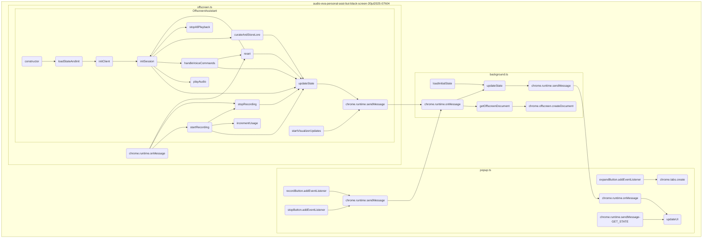

```mermaid
graph TD
    subgraph project[audio-eva-personal-asst-but-black-screen-20jul2025-07h04]
        direction LR
        subgraph background.ts
            direction TB
            A(updateState) --> B(chrome.runtime.sendMessage);
            C(loadInitialState) --> A;
            D(getOffscreenDocument) --> E(chrome.offscreen.createDocument);
            F(chrome.runtime.onMessage) --> D;
            F --> A;
        end

        subgraph popup.ts
            direction TB
            G(updateUI);
            H(recordButton.addEventListener) --> I(chrome.runtime.sendMessage);
            J(stopButton.addEventListener) --> I;
            K(expandButton.addEventListener) --> L(chrome.tabs.create);
            M(chrome.runtime.onMessage) --> G;
            N(chrome.runtime.sendMessage-GET_STATE) --> G;
        end

        subgraph offscreen.ts
            direction TB
            subgraph OffscreenAssistant
                direction TB
                O(constructor) --> P(loadStateAndInit);
                P --> Q(initClient);
                Q --> R(initSession);
                R --> S(updateState);
                R --> T(playAudio);
                R --> U(handleVoiceCommands);
                R --> V(curateAndStoreLore);
                R --> W(stopAllPlayback);
                U --> S;
                U --> X(reset);
                V --> S;
                Y(startRecording) --> S;
                Y --> Z(incrementUsage);
                Y --> AA(stopRecording);
                AA --> S;
                X --> R;
                X --> S;
                S --> BB(chrome.runtime.sendMessage);
                CC(startVisualizerUpdates) --> BB;
            end
            DD(chrome.runtime.onMessage) --> Y;
            DD --> AA;
            DD --> X;
        end
    end

    I --> F;
    BB --> F;
    B --> M;
```